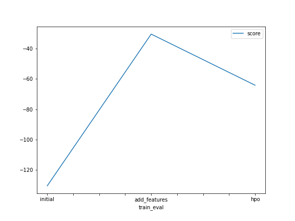
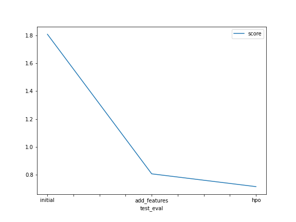

# Report: Predict Bike Sharing Demand with AutoGluon Solution
#### Luiz Otávio Matias

## Initial Training
### What did you realize when you tried to submit your predictions? What changes were needed to the output of the predictor to submit your results?

Kaggle reject the submission because there were < 0 in predictions. So, I needed to set everything to be > 0 in predictions.

### What was the top ranked model that performed?
Weighted Ensemble L3 was the top ranked model with new features such as hour, day and month.

## Exploratory data analysis and feature creation
### What did the exploratory analysis find and how did you add additional features?
That the features season and weather were categorical features. So I changed the types to categorical. I created hour, day and month by separating datetime feature.

### How much better did your model preform after adding additional features and why do you think that is?
After adding additional features, the publicScore from Kaggle performanced better from 1.80968 to 0.80515. I think, with the new features, the model learned better the pattern because of the features correlations with the target. 

## Hyper parameter tuning
### How much better did your model preform after trying different hyper parameters?
After trying different hyper parameters, the model performanced better from 0.80515 to 0.71301.

### If you were given more time with this dataset, where do you think you would spend more time?
Data analysis and feature engineering. Because this part is crucial. You can have a state-of-the-art model. But if your data is 'garbage', 'garbage in, garbage out'. You can have quality data and use a baseline model and get a nice performance.

### Create a table with the models you ran, the hyperparameters modified, and the kaggle score.
|    | model        |   time_limit | presets      | num_epochs   |   score |
|---:|:-------------|-------------:|:-------------|:-------------|--------:|
|  0 | initial      |          600 | best_quality | Default      | 1.80968 |
|  1 | add_features |          600 | best_quality | Default      | 0.80515 |
|  2 | hpo          |          600 | best_quality | 15           | 0.71301 |

### Create a line plot showing the top model score for the three (or more) training runs during the project.

### Create a line plot showing the top kaggle score for the three (or more) prediction submissions during the project.

## Summary
In this project, I used AutoGluon to train some models for the Bike Sharing Demand in Kaggle. I have done some feature engineering like create some new features and some data analysis. Also, I created three models and the best one was using some hyper parameter tunning (according to Kaggle score). The best model was Weighted Ensemble L3.